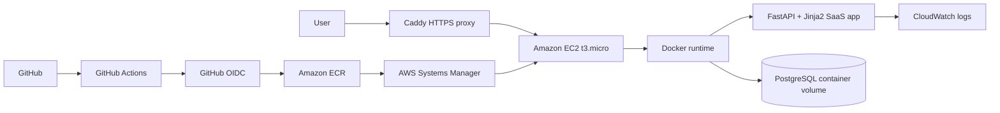
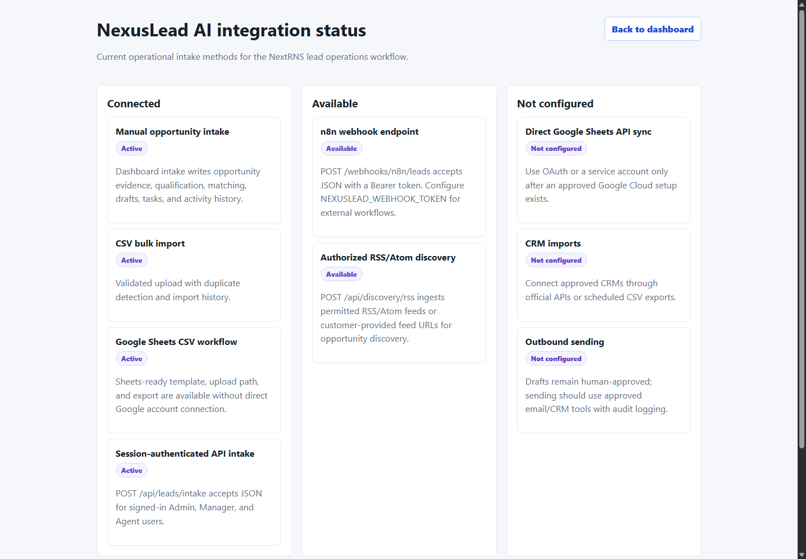

# NexusLead AI

Internal B2B Lead Operations Platform

NexusLead AI is an AWS-hosted internal SaaS application designed and developed for NextRNS-style BPO business development workflows. It gives admins, managers, and lead operations agents a Discovery-first workspace for authorized opportunity intake, intent extraction, qualification, client matching, assignment, human-reviewed outreach drafts, follow-up scheduling, conversion tracking, reporting, exports, and audit history.

The public environment uses realistic fictional business data so reviewers can exercise the workflows without exposing real customer records. The workflows are functional: opportunities are persisted in PostgreSQL, classified, scored, matched against client target profiles, assigned, routed through approval, placed into follow-up queues, and included in database-backed analytics.

## Live Deployments

AWS live application: https://99-79-66-16.sslip.io

AWS HTTP fallback: http://ec2-99-79-66-16.ca-central-1.compute.amazonaws.com

Render fallback: https://nexuslead-ai.onrender.com

Review credentials:

| Role | Email | Password | What to review |
| --- | --- | --- | --- |
| Admin | `admin@nextrns.local` | `admin123` | Full workspace, users, clients, exports, analytics |
| Manager | `manager@nextrns.local` | `manager123` | Lead review, draft approval, assignment, analytics |
| Agent | `agent@nextrns.local` | `agent123` | Assigned lead workflow, notes, statuses, task export |

Useful live routes:

- App entry: `/`
- Login: `/login`
- Dashboard: `/dashboard`
- API docs: `/docs`
- Integration status: `/integrations`
- Health check: `/health`
- Metrics: `/metrics`

## AWS Live Deployment

NexusLead AI is deployed on AWS using a low-cost single-instance EC2 path:



Architecture summary:

- GitHub Actions authenticates to AWS with OIDC, runs tests, builds a multi-arch Docker image, and pushes commit SHA plus `latest` tags to Amazon ECR.
- AWS Systems Manager runs the EC2 deploy script: pull image, start a candidate container, run migrations, health-check it, promote it, and keep PostgreSQL data intact.
- One `t3.micro` EC2 instance in `ca-central-1` runs Docker, Caddy, the FastAPI app container, and a PostgreSQL container backed by a named Docker volume.
- Caddy provides HTTPS at `https://99-79-66-16.sslip.io` and proxies to the internal FastAPI container.
- CloudWatch captures application runtime logs with 14-day retention.
- Daily compressed `pg_dump` backups are stored on the EC2 host with seven-day retention.
- Render remains configured as a fallback deployment.

Technology stack:

- FastAPI
- Jinja2
- SQLite for local development
- PostgreSQL for production
- Alembic migrations
- Docker
- Amazon ECR
- Amazon EC2
- AWS Systems Manager
- CloudWatch
- GitHub Actions OIDC

AWS deployment docs: [docs/aws-deployment.md](docs/aws-deployment.md)

AWS architecture diagram: [diagrams/aws-architecture.mmd](diagrams/aws-architecture.mmd)

## Screenshots

### Login


### Discovery Workspace


### Integration Status



## Feature Walkthrough

1. Sign in with one of the review roles.
2. Review Discovery Engine status, connected sources, qualified opportunities, client matches, and ready-for-approval outreach.
3. Process an authorized opportunity from manual intake, CSV, Google Sheets CSV, authenticated API, n8n webhook, or permitted RSS/Atom feed.
4. Review extracted intent, urgency, estimated value, duplicate probability, spam probability, match score, and match reasons.
5. Managers approve or override routing through assignment and outreach approval.
6. Agents work the follow-up queue, schedule next touchpoints, update notes, and move opportunities through the conversion pipeline.
7. Review the automation activity timeline for discovery, qualification, client comparison, duplicate detection, outreach drafting, follow-up scheduling, assignment, approval, task, and status events.
8. Use CSV import with validation, duplicate detection, and import history.
9. Export opportunities, tasks, Google Sheets-ready CSV, a Sheets intake template, or the daily report.

## Product Scope

NexusLead AI is designed for approved operational inputs and human-reviewed workflows:

- Manual opportunity entry
- CSV upload
- Google Sheets-ready CSV export/import using the template at `/templates/google-sheets-leads.csv`
- Session-authenticated JSON intake at `/api/leads/intake`
- Token-protected n8n webhook intake at `/webhooks/n8n/leads`
- Token-protected discovery intake at `/api/discovery/opportunities`
- Manager/admin RSS or Atom feed ingestion at `/api/discovery/rss` for feeds that permit programmatic reuse
- Approved CRM imports
- Public business directories where terms allow access
- Official APIs where available
- n8n workflows using approved integrations

Outreach remains human-reviewed before sending. The app does not implement auto-comment spam, ban-evasion, scraping bypasses, or automated outbound sending.

## Core Capabilities

- Admin, Manager, and Agent roles
- Role-based dashboard behavior
- Client target profiles with services, target customer, target industries, service categories, geographies, keywords, negative keywords, minimum opportunity value, outreach preferences, and qualification rules
- Opportunity intake through form, session-authenticated API, token-protected discovery API, webhook, CSV upload, Google Sheets-ready CSV, and permitted RSS/Atom feeds
- CSV bulk import validation, duplicate detection, and import history
- Deterministic opportunity classification by service category, location, urgency, estimated value, duplicate probability, spam probability, and client fit
- Automatic client recommendation with match percentage and match reasons
- Automatic follow-up task generation for qualified opportunities
- Outreach draft generation with human approval status
- Manager approval queue
- Pipeline statuses: New, Qualified, Contacted, Follow-up, Converted, Not Fit
- Follow-up task queue with due date scheduling
- Opportunity activity timeline and audit logging
- Automation status records for discovery, qualification, client matching, duplicate detection, outreach drafting, and follow-up scheduling
- Database-backed analytics and daily reporting
- File attachment metadata for leads
- Review response drafting workflow
- CSV exports for leads, tasks, and Google Sheets-ready data
- Integration status page distinguishing operational intake paths from future integrations
- Daily report endpoint
- Basic health and metrics endpoints
- FastAPI Swagger/OpenAPI docs
- AWS EC2 deployment path with HTTPS, ECR, OIDC, SSM, CloudWatch, and PostgreSQL
- Render Free fallback deployment with `render.yaml`

## Operational Workflow

```mermaid
flowchart LR
    Source[Authorized data source] --> Discover[Discover / ingest opportunity]
    Discover --> Intent[Extract intent]
    Intent --> Qualify[Classify and qualify]
    Qualify --> Enrich[Enrich available data]
    Enrich --> Match[Match to client target profile]
    Match --> Score[Calculate match score and reasons]
    Score --> Draft[Generate outreach draft]
    Draft --> Assign[Assign employee]
    Assign --> Approval[Human approval]
    Approval --> Follow[Follow-up]
    Follow --> Conversion[Conversion tracking]
    Conversion --> Reports[Analytics, exports, daily report]
    Conversion --> History[Activity timeline and audit log]
```



## Current Integration Status

Connected:

- Manual opportunity intake from the Discovery workspace
- CSV bulk import with required-column validation, duplicate detection, and import history
- Google Sheets-compatible CSV template and exports
- Session-authenticated JSON intake at `/api/leads/intake`
- CSV exports for leads, Google Sheets, and tasks

Available when configured:

- Token-protected n8n webhook intake at `/webhooks/n8n/leads`
- Token-protected discovery intake at `/api/discovery/opportunities`
- RSS/Atom opportunity discovery at `/api/discovery/rss` for feeds that permit reuse

Not configured:

- Direct Google Sheets API sync
- CRM imports through approved vendor APIs
- Email/CRM outbound sending after human approval
- Calendar reminders through approved calendar APIs

## Architecture

```mermaid
flowchart LR
    U[Admin / Manager / Agent] --> HTTPS[Caddy HTTPS]
    HTTPS --> APP[FastAPI + Jinja2 Discovery Workspace]
    APP --> AUTH[Role-aware sessions and APIs]
    APP --> DISC[Discovery / intake connectors]
    DISC --> SCORE[Intent, qualification, duplicate and spam checks]
    SCORE --> MATCH[Client target profile matching]
    MATCH --> OPS[Approval, assignment, follow-up, conversion]
    OPS --> DB[(PostgreSQL production / SQLite local)]
    OPS --> EXPORTS[CSV, Sheets CSV, daily reports]
    OPS --> AUDIT[Activity timeline and audit log]
    APP --> HEALTH[/health, /metrics, /docs]
    G[GitHub Actions] --> ECR[Amazon ECR]
    ECR --> APP
```

## Deployment Architecture

NexusLead AI is designed to run as a server-rendered FastAPI app on a low-cost AWS EC2 Docker host, with Render kept as a fallback.

| Component | Current MVP implementation |
| --- | --- |
| Primary hosting | Amazon EC2 `t3.micro` |
| Fallback hosting | Render Free Web Service |
| Runtime | Docker container |
| Build | GitHub Actions Docker build |
| Production start command | `scripts/start.sh` |
| Health check | `/health` |
| UI | Jinja2 templates served by FastAPI |
| API docs | FastAPI Swagger/OpenAPI at `/docs` |
| Local data store | SQLite |
| Production data store | PostgreSQL container volume through `DATABASE_URL` |
| CI/CD | GitHub Actions tests, OIDC auth, multi-arch Docker build, ECR push, SSM deploy, HTTPS health check |

Environment variables:

| Variable | Purpose |
| --- | --- |
| `NEXUSLEAD_SESSION_SECRET` | Signs login sessions |
| `NEXUSLEAD_UPLOAD_DIR` | Local upload metadata directory, defaults to `uploads` |
| `NEXUSLEAD_EMAIL_PROVIDER` | `console` for local notification behavior |
| `PORT` | Container port, defaults to `8000` |
| `DATABASE_URL` | PostgreSQL connection string in AWS production |
| `NEXUSLEAD_SECURE_COOKIES` | Enables Secure cookies behind HTTPS |
| `LOG_LEVEL` | Runtime logging level for CloudWatch |
| `NEXUSLEAD_WEBHOOK_TOKEN` | Shared token for n8n webhook lead intake |
| `NEXUSLEAD_API_KEY` | Optional fallback token for webhook intake |
| `NEXUSLEAD_DISCOVERY_FEED_URL` | Optional configured RSS/Atom discovery feed marker |

## Local Setup

```bash
python -m venv .venv
.venv\Scripts\activate
python -m pip install -r requirements.txt
uvicorn app.main:app --reload
```

Open:

```text
http://localhost:8000
```

Default local users are the same as the live review credentials.

## Testing

```bash
python -m pytest
```

GitHub Actions runs the same test suite on push and pull request.

## Docker

```bash
docker compose up --build
```

Open `http://localhost:8000`.

## Deployment Instructions

AWS EC2 is the primary deployment target.

1. Push changes to `main`.
2. GitHub Actions runs tests.
3. GitHub Actions builds and pushes the Docker image to ECR.
4. GitHub Actions sends an SSM command to EC2.
5. EC2 pulls the image, promotes the healthy candidate container, and keeps the PostgreSQL volume.
6. Confirm the AWS `/health` endpoint returns `status: ready`.
7. Confirm Admin, Manager, and Agent accounts can access the dashboard.
8. Keep Render available as a fallback by preserving `render.yaml`.

## Data And Production Notes

Local development uses SQLite. AWS production uses PostgreSQL with Alembic migrations. Additional production hardening items:

- Durable object storage for uploads
- Secret rotation and role administration policies
- Email provider integration such as SendGrid or AWS SES
- Calendar integration through Google Calendar or Microsoft Graph
- Observability with Prometheus/Grafana or a hosted monitoring tool

## Compliance Notes

Real integrations should use approved APIs, CRM imports, Google Sheets, manual entry, or authorized data sources. Outreach drafts must remain human-reviewed before use. This project does not include scraping bypasses, automated comment posting, or automated outbound sending.

## Additional Docs

- [Architecture](docs/architecture.md)
- [Deployment](docs/deployment.md)
- [AWS deployment](docs/aws-deployment.md)
- [Production readiness](docs/production-readiness.md)
- [Operations, jobs, email, calendar, monitoring, and migrations](docs/operations.md)
- [Google Sheets and n8n workflows](docs/n8n-expansion.md)
- [Compliance model](docs/compliance.md)
