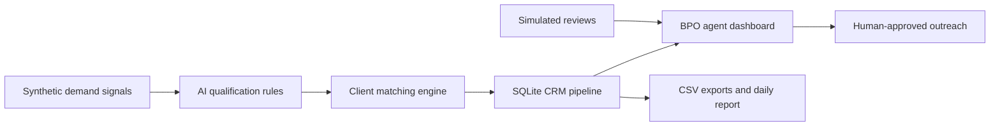

# NexusLead AI

NexusLead AI is an intelligent B2B lead operations platform for BPO-style sales teams. It helps agents discover synthetic demand signals, qualify leads, match them to client profiles, draft outreach for human review, manage follow-up tasks, and monitor simulated reviews.

The product scenario is based on a NextRNS-style sales operations team serving local businesses such as carpentry, real estate, security services, home services, cleaning, and custom cabinetry.

## Why It Was Built

BPO sales teams often work across multiple client types at once. The operational challenge is not just finding a lead; it is deciding whether the lead is relevant, which client should receive it, what the next action should be, and how to keep outreach compliant and human-reviewed.

NexusLead AI demonstrates that workflow with synthetic data and a small working FastAPI application.

## Business Problem

Lead operations teams need a repeatable process for:

- collecting approved lead sources
- qualifying urgency and fit
- matching leads to the right client
- drafting outreach without auto-sending
- tracking follow-ups and conversion status
- giving managers a daily operating view

This demo uses local synthetic records only. It does not scrape websites, bypass platform limits, collect real personal data, or auto-comment on posts.

## Product Features

- Lead discovery simulation from synthetic demand signals
- AI-style lead qualification using deterministic scoring rules
- Client matching by category, city, service area, and budget fit
- Human-approved outreach drafts with professional, friendly, short, and formal tones
- CRM-style lead, client, and follow-up task tables
- BPO agent dashboard with filters for client, city, category, and priority
- Simulated review monitoring with sentiment classification and response drafts
- Analytics for lead count, category, city, priority, follow-up queue, opportunity value, and status summary
- CSV exports for leads and task lists
- Daily Markdown-style operating report
- n8n expansion plan for future approved integrations

## Architecture



## Local Setup

```bash
python -m venv .venv
.venv\Scripts\activate
python -m pip install -r requirements.txt
uvicorn app.main:app --reload
```

Open:

```text
http://localhost:8000/dashboard
```

## Docker Setup

```bash
docker compose up --build
```

Open:

```text
http://localhost:8000/dashboard
```

## Demo Workflow

1. Start the app.
2. Open the dashboard.
3. Review high-priority synthetic leads.
4. Check the matched client and scoring explanation.
5. Review the suggested outreach draft.
6. Export leads or agent tasks as CSV.
7. Open `/reports/daily` for the daily operating summary.

Useful endpoints:

- `/dashboard`
- `/api/leads`
- `/api/analytics`
- `/export/leads.csv`
- `/export/tasks.csv`
- `/reports/daily`
- `/demo/discover`

## Sample Screenshots Placeholder

The `screenshots/` folder is included as a placeholder only. No fake screenshots are included.

## Compliance Note

This repository uses synthetic demo data only.

- No real website scraping
- No bypassing platform limits
- No automated commenting
- No collection of real personal data
- No auto-sending outreach

Future real integrations should use official APIs, CRM imports, opt-in datasets, manually approved lead sources, and human approval before any message is sent.

## n8n Expansion Plan

The `docs/n8n-expansion.md` file describes future workflow automation options:

- CRM import
- Email draft approval
- Slack or Teams alerts
- Google Sheets export
- Scheduled lead checks through approved APIs
- Review monitoring through approved sources

The current project does not implement real scraping or automated outreach.

## Deployment

The app is designed to run on free or low-cost hosting that supports Docker or ASGI apps, such as Render, Fly.io, or Railway. See `docs/deployment.md`.

## Future Roadmap

- User authentication and role-based agent queues
- Client-specific qualification rules
- Editable outreach approval workflow
- Import from CRM CSV files
- Approval audit log
- More detailed review response workflow
- Static read-only demo export for GitHub Pages
