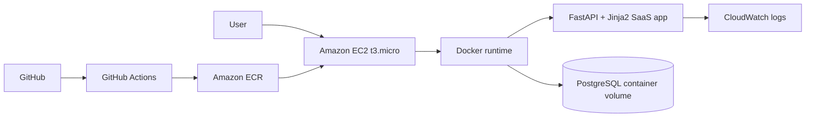
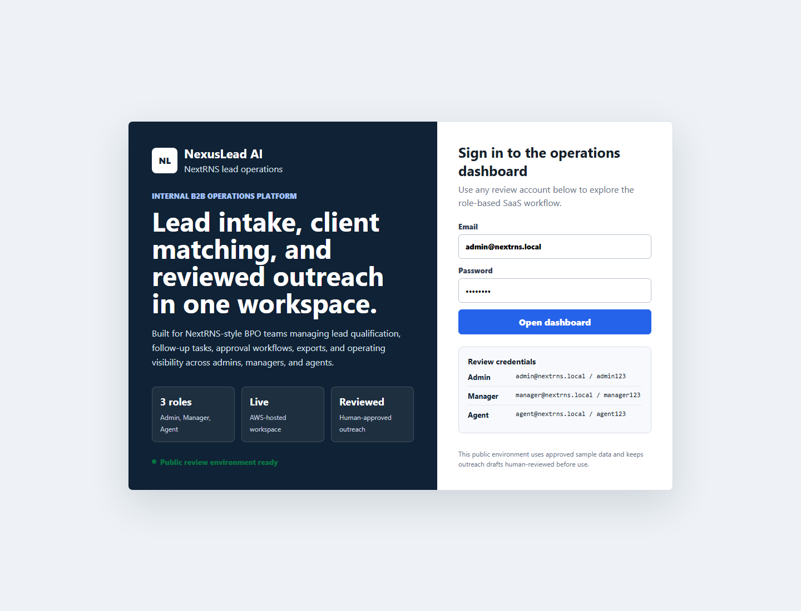
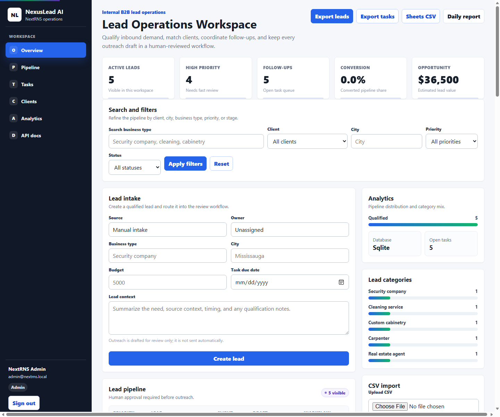

# NexusLead AI

NexusLead AI is a deployed internal B2B lead operations MVP for NextRNS-style BPO teams. It gives admins, managers, and lead generation specialists a shared workspace for lead intake, qualification, client matching, human-reviewed outreach drafts, follow-up tasks, reporting, and CSV exports.

This repository is a working portfolio MVP, not a claim of production customer adoption. The live app uses approved sample data and shows product, engineering, deployment, and operations readiness.

## Live Deployments

AWS live application: http://ec2-99-79-66-16.ca-central-1.compute.amazonaws.com

Render fallback: https://nexuslead-ai.onrender.com

Review credentials:

| Role | Email | Password | What to review |
| --- | --- | --- | --- |
| Admin | `admin@nextrns.local` | `admin123` | Full workspace, users, clients, exports, analytics |
| Manager | `manager@nextrns.local` | `manager123` | Lead review, draft approval, assignment, analytics |
| Agent | `agent@nextrns.local` | `agent123` | Assigned lead workflow, notes, statuses, task export |

Useful live routes:

- App entry: `/`
- Login: `/login`
- Dashboard: `/dashboard`
- API docs: `/docs`
- Health check: `/health`
- Metrics: `/metrics`

## AWS Live Deployment

NexusLead AI is deployed on AWS using a low-cost single-instance EC2 path:



Architecture summary:

- GitHub Actions runs tests, builds a multi-arch Docker image, and pushes commit SHA plus `latest` tags to Amazon ECR.
- One `t3.micro` EC2 instance in `ca-central-1` runs Docker, the FastAPI app container, and a PostgreSQL container backed by a named Docker volume.
- A 10-minute EC2 cron job refreshes ECR auth, pulls `latest`, and restarts the app container without replacing the database volume.
- CloudWatch captures application runtime logs.
- Render remains configured as a fallback deployment.

Technology stack:

- FastAPI
- Jinja2
- SQLite for local development
- PostgreSQL for production
- Alembic migrations
- Docker
- Amazon ECR
- Amazon EC2
- CloudWatch
- GitHub Actions OIDC

AWS deployment docs: [docs/aws-deployment.md](docs/aws-deployment.md)

AWS architecture diagram: [diagrams/aws-architecture.mmd](diagrams/aws-architecture.mmd)

## Screenshots

### Login



### Operations Dashboard



## Feature Walkthrough

1. Sign in with one of the review roles.
2. Review KPI cards for active leads, high-priority leads, follow-ups, conversion, and estimated opportunity value.
3. Use search and filters to narrow the lead pipeline by client, city, business type, priority, and status.
4. Create a lead through the lead intake form.
5. Review the deterministic score, matched client, priority badge, and outreach draft.
6. Update status, add notes, assign ownership, attach file metadata, or approve an outreach draft depending on role.
7. Review follow-up tasks, client profile cards, pipeline analytics, lead category charts, and audit activity.
8. Export leads, tasks, Google Sheets-ready CSV, or the daily report.

## Product Scope

NexusLead AI is designed for approved operational inputs:

- Manual lead entry
- CSV upload
- Google Sheets-ready CSV export/import
- Approved CRM imports
- Public business directories where terms allow access
- Official APIs where available
- n8n workflows using approved integrations

Outreach remains human-reviewed before sending. The app does not implement auto-comment spam, ban-evasion, scraping bypasses, or automated outbound sending.

## Core Capabilities

- Admin, Manager, and Agent roles
- Role-based dashboard behavior
- Multi-tenant client profiles with business type, service area, city, budget range, contact email, and notes
- Lead intake and CSV import
- Deterministic lead scoring and client matching
- Outreach draft generation with human approval status
- Pipeline statuses: New, Qualified, Contacted, Follow-up, Converted, Not Fit
- Follow-up task queue with due dates
- Notes/history and audit logging
- File attachment metadata for leads
- Review response drafting workflow
- CSV exports for leads, tasks, and Google Sheets-ready data
- Daily report endpoint
- Basic health and metrics endpoints
- FastAPI Swagger/OpenAPI docs
- AWS EC2 deployment path with ECR and PostgreSQL
- Render Free fallback deployment with `render.yaml`

## Architecture

```mermaid
flowchart LR
    U[Admin / Manager / Agent] --> R[Render Free Web Service]
    R --> F[FastAPI App]
    F --> T[Jinja2 SaaS UI]
    F --> A[Role-Aware API Routes]
    F --> S[Services Layer]
    S --> DB[(SQLite MVP Database)]
    S --> E[CSV / Daily Report Exports]
    S --> N[Console Email Provider]
    S --> J[Local Background Job Registry]
    F --> H[/health and /metrics]
    G[GitHub main branch] --> R
```

## Deployment Architecture

NexusLead AI is designed to run as a server-rendered FastAPI app on a low-cost AWS EC2 Docker host, with Render kept as a fallback.

| Component | Current MVP implementation |
| --- | --- |
| Primary hosting | Amazon EC2 `t3.micro` |
| Fallback hosting | Render Free Web Service |
| Runtime | Docker container |
| Build | GitHub Actions Docker build |
| Production start command | `scripts/start.sh` |
| Health check | `/health` |
| UI | Jinja2 templates served by FastAPI |
| API docs | FastAPI Swagger/OpenAPI at `/docs` |
| Local data store | SQLite |
| Production data store | PostgreSQL container volume through `DATABASE_URL` |
| CI/CD | GitHub Actions tests, multi-arch Docker build, ECR push; EC2 cron pulls `latest` |

Environment variables:

| Variable | Purpose |
| --- | --- |
| `NEXUSLEAD_SESSION_SECRET` | Signs login sessions |
| `NEXUSLEAD_UPLOAD_DIR` | Local upload metadata directory, defaults to `uploads` |
| `NEXUSLEAD_EMAIL_PROVIDER` | `console` for local notification behavior |
| `PORT` | Container port, defaults to `8000` |
| `DATABASE_URL` | PostgreSQL connection string in AWS production |
| `LOG_LEVEL` | Runtime logging level for CloudWatch |

## Local Setup

```bash
python -m venv .venv
.venv\Scripts\activate
python -m pip install -r requirements.txt
uvicorn app.main:app --reload
```

Open:

```text
http://localhost:8000
```

Default local users are the same as the live review credentials.

## Testing

```bash
python -m pytest
```

GitHub Actions runs the same test suite on push and pull request.

## Docker

```bash
docker compose up --build
```

Open `http://localhost:8000`.

## Deployment Instructions

AWS EC2 is the primary deployment target.

1. Push changes to `main`.
2. GitHub Actions runs tests.
3. GitHub Actions builds and pushes the Docker image to ECR.
4. The EC2 deployment cron pulls `latest` and restarts the app container.
5. Confirm the AWS `/health` endpoint returns `status: ready`.
6. Confirm Admin, Manager, and Agent accounts can access the dashboard.
7. Keep Render available as a fallback by preserving `render.yaml`.

## Data And Production Notes

Local development uses SQLite. AWS production should use PostgreSQL with Alembic migrations. Additional production hardening items:

- Durable object storage for uploads
- Secret rotation and role administration policies
- Email provider integration such as SendGrid or AWS SES
- Calendar integration through Google Calendar or Microsoft Graph
- Observability with Prometheus/Grafana or a hosted monitoring tool

## Compliance Notes

Real integrations should use approved APIs, CRM imports, Google Sheets, manual entry, or authorized data sources. Outreach drafts must remain human-reviewed before use. This project does not include scraping bypasses, automated comment posting, or automated outbound sending.

## Additional Docs

- [Architecture](docs/architecture.md)
- [Deployment](docs/deployment.md)
- [AWS deployment](docs/aws-deployment.md)
- [Operations, jobs, email, calendar, monitoring, and migrations](docs/operations.md)
- [Google Sheets and n8n workflows](docs/n8n-expansion.md)
- [Compliance model](docs/compliance.md)
