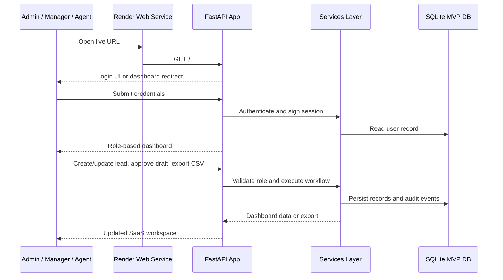

# Architecture

NexusLead AI is a deployed FastAPI MVP for an internal B2B lead operations workflow. It is designed to show how a NextRNS-style BPO team could manage lead intake, qualification, client matching, outreach draft review, task queues, exports, and operational visibility.

The current deployment is intentionally lightweight:

- FastAPI backend and server-rendered Jinja2 UI
- SQLite for local/demo data
- Render Free web service for public access
- Role-based sessions for Admin, Manager, and Agent workflows
- Deterministic scoring and matching rules rather than external AI dependencies
- Console/mock provider for notification readiness
- Background job registry for future scheduled checks, reports, and reminders

## Request Flow



## System Diagram

```mermaid
flowchart LR
    U[Admin / Manager / Agent] --> R[Render Free Web Service]
    R --> F[FastAPI App]
    F --> UI[Jinja2 SaaS UI]
    F --> API[Role-Aware API Routes]
    API --> S[Services Layer]
    S --> DB[(SQLite MVP Database)]
    S --> CSV[CSV Exports]
    S --> REP[Daily Report]
    S --> AUD[Audit Events]
    S --> JOB[Background Job Registry]
    S --> MAIL[Console Email Provider]
    F --> OBS[/health /metrics /docs]
    GH[GitHub main branch] --> R
```

## Role Model

| Role | Capabilities |
| --- | --- |
| Admin | Manage users, clients, leads, exports, analytics, background readiness, audit activity |
| Manager | Review leads, approve outreach drafts, assign agents, inspect analytics |
| Agent | Create leads, update assigned statuses, add notes, attach file metadata, export assigned tasks |

## Data Model Summary

The SQLite MVP schema includes:

- `users`
- `clients`
- `leads`
- `lead_events`
- `follow_up_tasks`
- `reviews`
- `audit_logs`
- `lead_attachments`

## Design Boundaries

This is a deployed MVP and portfolio project, not a claim of production customer adoption. The app uses approved sample data and avoids real scraping, automated commenting, scraping bypasses, automated outreach sending, and real personal data collection.

Future production hardening should add PostgreSQL migrations, durable upload storage, managed secrets, provider-backed email, calendar integrations, observability, and a data retention policy.
